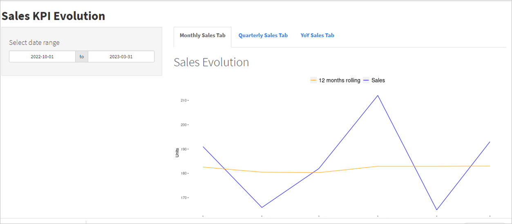

# Sales Evolution Dashboard

Este es un dashboard creado con la ayuda de ChatGPT. El dataset para este dashboard es uno fictio creado al azar pero que trata de emular el formato de tablas
que uno podría encontrarse en el mundo real.

Se destaca la evolución de tres KPIs en el tiempo: venta en unidades (sales), facturación USD $ (sales_revenue) y margen USD $ (margin).
En el dashboard se han colocado tres pestañas para mirar la data por evolución mensual, trimestral y anual.

Las pestañas de evolución mensual y trimestral cuentan con el promedio móvil de 12 meses el cual se acomoda al rango de fechas seleccionadas sin afectar los meses acumulados. Este fue el principal reto a la hora de programar el shiny con controles reactive.

Las anotaciones y comentarios se encuentran en el script.

Asimismo dejo el link para poder ver el shiny app:

https://jf6muh-paulo-pe0a.shinyapps.io/sales_evolution_demo/
